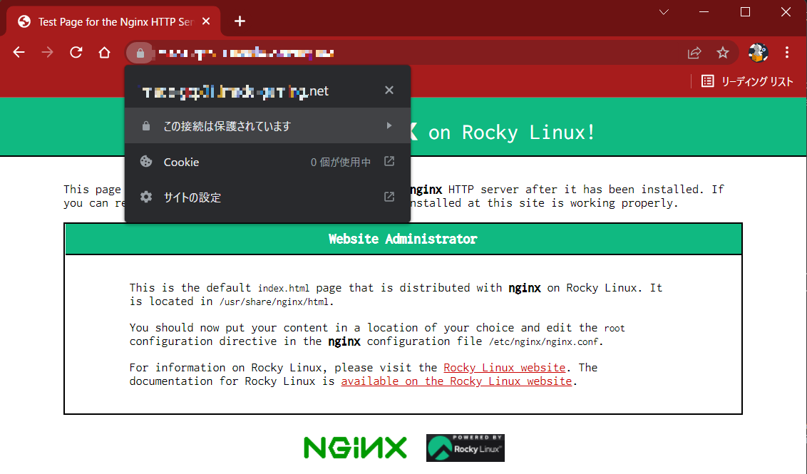

# GKE Ingress オブジェクトを利用して HTTPS 負荷分散する

GKEの`Ingressオブジェクト`を利用した HTTPS LB を作成して、
バックエンドに対する負荷分散を行う

## 前提

- 確認用VMインスタンスにNGINXをインストール済み
- 80 port を開ける 443も最初の確認時に開ける
  - LBでTLS終端させる想定なのでインスタンスは80のみでOK
- Domainを取得している(名前.com とか GoogleDomain)
- DNSサーバはCloudDNSを使う

## 準備

- TLSを使えるように証明書とドメインを確保
  - TLS証明書(Let's Encryptで発行)
  - ドメイン(Google Domainで購入)

## 手順

### Let's EncryptでTLS証明書発行

[Certbotのインストールガイド](https://certbot.eff.org/instructions?ws=nginx&os=centosrhel8)を見ながらやっていく
`RockyLinux`がなかったので`CentOS8`のやつをみてやったけどうまくいった

snapd というパッケージマネージャのようなものでインストールする方式にかわった模様
[snapdのインストールページ](https://snapcraft.io/docs/installing-snapd)を見て導入する

- snapd install

まずsnapdをインストールする

```
# dnf install -y snapd

# systemctl enable --now snapd.socket
Created symlink /etc/systemd/system/sockets.target.wants/snapd.socket → /usr/lib/systemd/system/snapd.socket.

# ln -s /var/lib/snapd/snap /snap

# systemctl start snapd

# systemctl status snapd
● snapd.service - Snap Daemon
   Loaded: loaded (/usr/lib/systemd/system/snapd.service; disabled; vendor preset: disabled)
   Active: active (running) since Mon 2022-03-21 17:17:25 JST; 4s ago
 Main PID: 202608 (snapd)
    Tasks: 8 (limit: 49466)
   Memory: 14.3M
   CGroup: /system.slice/snapd.service
           └─202608 /usr/libexec/snapd/snapd
```

- certbot install

```
# snap install core; snap refresh core
core 16-2.54.4 from Canonical✓ installed
snap "core" has no updates available

# snap install --classic certbot
certbot 1.25.0 from Certbot Project (certbot-eff✓) installed
```

- setup certbot

```
# ln -s /snap/bin/certbot /usr/bin/certbot

# snap set certbot trust-plugin-with-root=ok

# snap install certbot-dns-google
certbot-dns-google 1.25.0 from Certbot Project (certbot-eff✓) installed
```

### Google Cloud でサービスアカウント作成

certbotがCloudDNSのリソースにアクセスできるように
サービスアカウントを作成する

- 名前   : certbot@<project_id>.iam.gserviceaccount.com
- ロール : roles/dns.admin (DNS 管理者)

作成したら、「キー」タブより、「鍵を追加」→「新しい鍵を作成」→「JSON」を選択して「作成」

自動的にPCに保存されるので、ファイルの中身を確認用VMのどこかに保存
(今回は`.secrets/google/certbot_sa.json`として保存した)

### 証明書作成

ワイルドカード証明書(*.example.com)を発行する
発行方法は各DNSサーバによって違うので、それぞれ自分が利用するものを確認する
[CloudDNSを利用する場合の方法はこちら](https://certbot-dns-google.readthedocs.io/en/stable/)
↑のExapmlesに書いてあるコマンドを実行する
※google.jsonはさっき作成&DLしたサービスアカウントの鍵のこと

```
# certbot certonly --dns-google --dns-google-credentials ~/.secrets/google/certbot_sa.json -d *.example.com -i nginx

Saving debug log to /var/log/letsencrypt/letsencrypt.log
Enter email address (used for urgent renewal and security notices)
 (Enter 'c' to cancel): cokemaniaIIDX@gmail.com ←メールアドレスを入力

- - - - - - - - - - - - - - - - - - - - - - - - - - - - - - - - - - - - - - - -
Please read the Terms of Service at
https://letsencrypt.org/documents/LE-SA-v1.2-November-15-2017.pdf. You must
agree in order to register with the ACME server. Do you agree?
- - - - - - - - - - - - - - - - - - - - - - - - - - - - - - - - - - - - - - - -
(Y)es/(N)o: Y ←ライセンスを読み、同意する

- - - - - - - - - - - - - - - - - - - - - - - - - - - - - - - - - - - - - - - -
Would you be willing, once your first certificate is successfully issued, to
share your email address with the Electronic Frontier Foundation, a founding
partner of the Let's Encrypt project and the non-profit organization that
develops Certbot? We'd like to send you email about our work encrypting the web,
EFF news, campaigns, and ways to support digital freedom.
- - - - - - - - - - - - - - - - - - - - - - - - - - - - - - - - - - - - - - - -
(Y)es/(N)o: Y ← 登録メールに団体からのメールを受け取るかどうか
Account registered.
Requesting a certificate for *.example.com
Waiting 60 seconds for DNS changes to propagate

Successfully received certificate.
Certificate is saved at: /etc/letsencrypt/live/example.com/fullchain.pem
Key is saved at:         /etc/letsencrypt/live/example.com/privkey.pem
This certificate expires on 2022-06-19.
These files will be updated when the certificate renews.
Certbot has set up a scheduled task to automatically renew this certificate in the background.

- - - - - - - - - - - - - - - - - - - - - - - - - - - - - - - - - - - - - - - -
If you like Certbot, please consider supporting our work by:
 * Donating to ISRG / Let's Encrypt:   https://letsencrypt.org/donate
 * Donating to EFF:                    https://eff.org/donate-le
- - - - - - - - - - - - - - - - - - - - - - - - - - - - - - - - - - - - - - - -
```

`/etc/letsencrypt/live/<ドメイン>/`に鍵と証明書がインストールされるので、
nginxに持っていく

```
# cp /etc/letsencrypt/live/<ドメイン>/privkey.pem /etc/nginx/tls/server.key
# cp /etc/letsencrypt/live/<ドメイン>/fullchain.pem /etc/nginx/tls/server.crt
```

SSLの設定を追加

```
# vi /etc/nginx/conf.d/tls.conf
server {
    listen 443 ssl;

    ssl_certificate             /etc/nginx/tls/server.crt;
    ssl_certificate_key         /etc/nginx/tls/server.key;
}
```

設定確認し、reload

```
# nginx -t
nginx: the configuration file /etc/nginx/nginx.conf syntax is ok
nginx: configuration file /etc/nginx/nginx.conf test is successful

# nginx -s reload

# systemctl status nginx
● nginx.service - The nginx HTTP and reverse proxy server
   Loaded: loaded (/usr/lib/systemd/system/nginx.service; disabled; vendor preset: disabled)
   Active: active (running) since Mon 2022-03-21 16:41:10 JST; 2h 34min ago
```

- ブラウザで確認

`https://<ドメイン>/`にアクセスしてアクセスできることを確認



これで有効なTLS証明書を発行できた

### GKE cluster 作成

- terraform で作成

- 設定:

| 項目              | 設定値           |
| ----------------- | ---------------- |
| cluster_name      | ingress-cluster  |
| location          | asia-northeast1  |
| preemptible       | 有効             |
| node数            | 1                |
| node_pool_name    | ingress_nodepool |
| node_machine_type | e2-medium        |
| service account   | ingress-cluster  |

- サービスアカウントに権限付与

clusterに設定するサービスアカウントは`Artifact Registry`にアクセスできる必要があるので、権限を付与する
権限は`ArtifactRegistry 読み取り (roles/artifactregistry.reader)`

- kubeconfigエントリの生成

↓のコマンドを実行することで、`kubectl`コマンドを実行したときの対象が`さっき作成したクラスタ`になる

```
$ gcloud container clusters get-credentials --region=asia-northeast1 ingress-cluster

$ kubectl config view
apiVersion: v1
clusters:
- cluster:
    certificate-authority-data: DATA+OMITTED
    server: https://35.187.207.69
  name: gke_<PROJECTID>_asia-northeast1_ingress-cluster
contexts:
- context:
    cluster: gke_<PROJECTID>_asia-northeast1_ingress-cluster
    user: gke_<PROJECTID>_asia-northeast1_ingress-cluster
  name: gke_<PROJECTID>_asia-northeast1_ingress-cluster
current-context: gke_<PROJECTID>_asia-northeast1_ingress-cluster
kind: Config
preferences: {}
users:
- name: gke_<PROJECTID>_asia-northeast1_ingress-cluster
  user:
    auth-provider:
      config:
        cmd-args: config config-helper --format=json
        cmd-path: /usr/lib64/google-cloud-sdk/bin/gcloud
        expiry-key: '{.credential.token_expiry}'
        token-key: '{.credential.access_token}'
      name: gcp
```

### Artifact Registry 作成

- terraform で作成

- 設定:

| 項目            | 設定値          |
| --------------- | --------------- |
| repository_name | ingress         |
| location        | asia-northeast1 |
| format          | DOCKER          |

- 認証の構成

↓のコマンドを実行することで、DockerがArtifact Registryに接続してイメージのpush,pullができるようになる

```sh
$ gcloud auth configure-docker asia-northeast1-docker.pkg.dev
```

### コンテナ作成、GCRにプッシュ

nginxの公式イメージをプルしてきて`Google Artifact Registry`にプッシュする
特に中身はいじらずそのまま使う

- pull

```
$ docker pull nginx:latest

$ docker images
REPOSITORY                                                TAG       IMAGE ID       CREATED         SIZE
nginx                                                     latest    f2f70adc5d89   3 days ago      142MB
```

- tagづけ

pull してきた nginx イメージを Artifact Registryにアップロードできるようにタグ付けする

```
$ docker tag nginx asia-northeast1-docker.pkg.dev/<GCP_PROJECT_ID>/ingress/nginx:latest
```

- push

imageをpush！

```
$ docker push asia-northeast1-docker.pkg.dev/<PROJECTID>/ingress/nginx
```

### Deployment の作成

```yaml
apiVersion: apps/v1
kind: Deployment
metadata:
  name: ingress-deployment
  labels:
    app: nginx
spec:
  replicas: 3
  selector:
    matchLabels:
      app: nginx
  template:
    metadata:
      labels:
        app: nginx
    spec:
      containers:
      - name: app-1
        image: "asia-northeast1-docker.pkg.dev/imade-gaming-265014/ingress/nginx:latest"
        ports:
        - containerPort: 8080
```

- 適用

```
$ kubectl apply -f ingress_deployment.yaml
deployment.apps/ingress-deployment created
```

### Service の作成

```yaml
apiVersion: v1
kind: Service
metadata:
  name: ingress-service
spec:
  type: NodePort
  selector:
    app: nginx
  ports:
  - protocol: TCP
    port: 80
    targetPort: 8080
```

- 適用

```
$ kubectl apply -f ingress_service.yaml
service/ingress-service created
```

### Ingress の作成

```yaml
apiVersion: networking.k8s.io/v1
kind: Ingress
metadata:
  name: ingress
  annotations:
    kubernetes.io/ingress.class: "gce"
spec:
  rules:
  - http:
      paths:
      - path: /*
        pathType: ImplementationSpecific
        backend:
          service:
            name: ingress-service
            port:
              number: 80
```

- 適用

```
$ kubectl apply -f ingress.yaml
ingress.networking.k8s.io/ingress created
```

