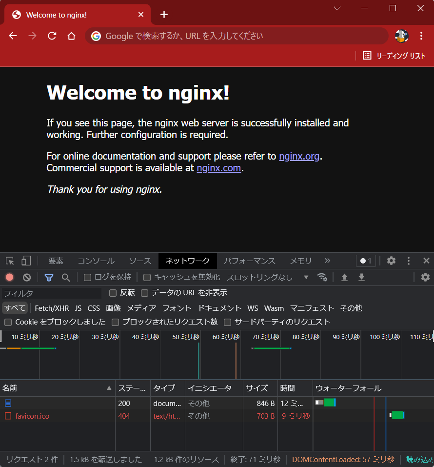

# GKE Ingress オブジェクトを利用して HTTPS 負荷分散する

GKEの`Ingressオブジェクト`を利用した HTTPS LB を作成して、
バックエンドに対する負荷分散を行う方法を解説します
ついでにTLS証明書の発行方法も紹介してます

# 目標


`ユーザが"https://ingress.<ドメイン>.com/"でアクセスしたらnginxのウェルカムページが表示される`
↑この状態を目指します
もちろん、ドメイン名は任意です

# 構成


- 開発サーバ:
  - 開発・確認用サーバとしてGoogleComputeEngineのVMを利用
  - kubectlなどのコマンドもここで実施
  - yum(dnf)でNginxをインストール済
- GKE:
  - deployment:
    - podを3つ起動
  - pod:
    - Nginxコンテナを起動
      - port 8080 でリッスン
  - Service:
    - port 80 からのリクエストを Nginxコンテナの port 8080 に 転送
  - Ingress:
    - port 80 で Service に転送
- TLS証明書:
  - Let's Encrypt certbot の無料TLS証明書を発行し、利用する
- DNSレコード登録はCloud DNSを使う

# 前提知識など

専門用語に関する知識はすべて割愛しているので、
不安がある方はそれぞれ公式ドキュメントへどうぞ(※特にKubernetes)

## ある程度Kubernetesの知識がある

Deployment, Service, Podが分かればなんとかなりそう

## ある程度GoogleCloudの知識がある

コンソールの操作や、サービスアカウント、IAMロールの知識を少々

## ある程度SSL/TLSの知識がある

SSL/TLSがどのように働いているのか、そもそもSSL/TLSって何？みたいな部分は理解している前提で進めます

## Domainを取得している(お名前.com とか GoogleDomain)

1,500円/年のお金かかりますが、あると何かと便利なので取得してみてはいかがでしょうか

# 手順

## 大まかな流れ

1. TLS証明書発行
2. GKEクラスタ作成
3. Nginxコンテナイメージ作成
4. Deployment, Service, Ingress 作成
5. HTTPSに対応させる

## Let's EncryptでTLS証明書発行

それではやっていきましょう
まずは [Let’s Encrypt - certbot](https://certbot.eff.org/) でTLS証明書を発行します
なんと、無料です！

[Certbotのインストールガイド](https://certbot.eff.org/instructions?ws=nginx&os=centosrhel8)を見ながらやっていきます

snapd というパッケージマネージャのようなものでインストールする方式のようです
[snapdのインストールページ](https://snapcraft.io/docs/installing-snapd)を見て導入する

- snapd install

まずsnapdをインストールします

```
# dnf install -y snapd

# systemctl enable --now snapd.socket
Created symlink /etc/systemd/system/sockets.target.wants/snapd.socket → /usr/lib/systemd/system/snapd.socket.

# ln -s /var/lib/snapd/snap /snap

# systemctl start snapd

# systemctl status snapd
● snapd.service - Snap Daemon
   Loaded: loaded (/usr/lib/systemd/system/snapd.service; disabled; vendor preset: disabled)
   Active: active (running) since Mon 2022-03-21 17:17:25 JST; 4s ago
 Main PID: 202608 (snapd)
    Tasks: 8 (limit: 49466)
   Memory: 14.3M
   CGroup: /system.slice/snapd.service
           └─202608 /usr/libexec/snapd/snapd
```

- certbot install

```
# snap install core; snap refresh core
core 16-2.54.4 from Canonical✓ installed
snap "core" has no updates available

# snap install --classic certbot
certbot 1.25.0 from Certbot Project (certbot-eff✓) installed
```

- setup certbot

```
# ln -s /snap/bin/certbot /usr/bin/certbot

# snap set certbot trust-plugin-with-root=ok

# snap install certbot-dns-google
certbot-dns-google 1.25.0 from Certbot Project (certbot-eff✓) installed
```

### Google Cloud でサービスアカウント作成

certbotがCloudDNSのリソースにアクセスできるように
サービスアカウントを作成します

- 名前   : certbot@<project_id>.iam.gserviceaccount.com
- ロール : roles/dns.admin (DNS 管理者)

作成したら、「キー」タブより、「鍵を追加」→「新しい鍵を作成」→「JSON」を選択して「作成」

自動的にPCに保存されるので、ファイルの中身を確認用VMのどこかに保存
(今回は`.secrets/google/certbot_sa.json`として保存した)

### 証明書作成

ワイルドカード証明書(*.example.com)を発行します

発行方法は各DNSサーバによって違うので、それぞれ自分が利用するものを確認しましょう
この記事ではCloudDNSを使います
[CloudDNSを利用する場合の方法はこちら](https://certbot-dns-google.readthedocs.io/en/stable/)
↑のExapmlesに書いてあるコマンドを実行する
※google.jsonはさっき作成&DLしたサービスアカウントの鍵のこと

```
# certbot certonly --dns-google --dns-google-credentials ~/.secrets/google/certbot_sa.json -d *.example.com -i nginx

Saving debug log to /var/log/letsencrypt/letsencrypt.log
Enter email address (used for urgent renewal and security notices)
 (Enter 'c' to cancel): cokemaniaIIDX@gmail.com ←メールアドレスを入力

- - - - - - - - - - - - - - - - - - - - - - - - - - - - - - - - - - - - - - - -
Please read the Terms of Service at
https://letsencrypt.org/documents/LE-SA-v1.2-November-15-2017.pdf. You must
agree in order to register with the ACME server. Do you agree?
- - - - - - - - - - - - - - - - - - - - - - - - - - - - - - - - - - - - - - - -
(Y)es/(N)o: Y ←ライセンスを読み、同意する

- - - - - - - - - - - - - - - - - - - - - - - - - - - - - - - - - - - - - - - -
Would you be willing, once your first certificate is successfully issued, to
share your email address with the Electronic Frontier Foundation, a founding
partner of the Let's Encrypt project and the non-profit organization that
develops Certbot? We'd like to send you email about our work encrypting the web,
EFF news, campaigns, and ways to support digital freedom.
- - - - - - - - - - - - - - - - - - - - - - - - - - - - - - - - - - - - - - - -
(Y)es/(N)o: Y ← 登録メールに団体からのメールを受け取るかどうか
Account registered.
Requesting a certificate for *.example.com
Waiting 60 seconds for DNS changes to propagate

Successfully received certificate.
Certificate is saved at: /etc/letsencrypt/live/example.com/fullchain.pem
Key is saved at:         /etc/letsencrypt/live/example.com/privkey.pem
This certificate expires on 2022-06-19.
These files will be updated when the certificate renews.
Certbot has set up a scheduled task to automatically renew this certificate in the background.

- - - - - - - - - - - - - - - - - - - - - - - - - - - - - - - - - - - - - - - -
If you like Certbot, please consider supporting our work by:
 * Donating to ISRG / Let's Encrypt:   https://letsencrypt.org/donate
 * Donating to EFF:                    https://eff.org/donate-le
- - - - - - - - - - - - - - - - - - - - - - - - - - - - - - - - - - - - - - - -
```

`/etc/letsencrypt/live/<ドメイン>/`に鍵と証明書がインストールされるので、
nginxに持っていきます

```
# cp /etc/letsencrypt/live/<ドメイン>/privkey.pem /etc/nginx/tls/server.key
# cp /etc/letsencrypt/live/<ドメイン>/fullchain.pem /etc/nginx/tls/server.crt
```

SSLの設定を追加

```
# vi /etc/nginx/conf.d/tls.conf
server {
    listen 443 ssl;

    ssl_certificate             /etc/nginx/tls/server.crt;
    ssl_certificate_key         /etc/nginx/tls/server.key;
}
```

設定確認し、reload

```
# nginx -t
nginx: the configuration file /etc/nginx/nginx.conf syntax is ok
nginx: configuration file /etc/nginx/nginx.conf test is successful

# nginx -s reload

# systemctl status nginx
● nginx.service - The nginx HTTP and reverse proxy server
   Loaded: loaded (/usr/lib/systemd/system/nginx.service; disabled; vendor preset: disabled)
   Active: active (running) since Mon 2022-03-21 16:41:10 JST; 2h 34min ago
```

### ブラウザで証明書の有効性確認

`https://開発サーバのIP(もしくはドメイン)`にアクセスできることを確認


これで有効なTLS証明書を発行できました！

## GKE cluster 作成

証明書の作成が出来たので、GKEを作っていきます

- サービスアカウント作成

クラスタ作成前に、まずはクラスタに適用するサービスアカウントを作成します

クラスタに設定するサービスアカウントは`Artifact Registry`にアクセスできる必要があるので、
`ArtifactRegistry 読み取り (roles/artifactregistry.reader)`権限を付与します

| 項目     | 設定値                        |
| -------- | ----------------------------- |
| name(id) | ingress-cluster               |
| role     | roles/artifactregistry.reader |

- GKEクラスタ作成

続きまして、GKEクラスタを作成していきます

| 項目              | 設定値           |
| ----------------- | ---------------- |
| cluster_name      | ingress-cluster  |
| location          | asia-northeast1  |
| preemptible       | 有効             |
| node数            | 1                |
| node_pool_name    | ingress_nodepool |
| node_machine_type | e2-medium        |
| service account   | ingress-cluster  |

- kubeconfigエントリの生成

↓のコマンドを実行することで、`kubectl`コマンドを実行したときの対象が`さっき作成したクラスタ`になる

```
$ gcloud container clusters get-credentials --region=asia-northeast1 ingress-cluster

$ kubectl config view
apiVersion: v1
clusters:
- cluster:
    certificate-authority-data: DATA+OMITTED
    server: https://35.187.207.69
  name: gke_<PROJECTID>_asia-northeast1_ingress-cluster
contexts:
- context:
    cluster: gke_<PROJECTID>_asia-northeast1_ingress-cluster
    user: gke_<PROJECTID>_asia-northeast1_ingress-cluster
  name: gke_<PROJECTID>_asia-northeast1_ingress-cluster
current-context: gke_<PROJECTID>_asia-northeast1_ingress-cluster
kind: Config
preferences: {}
users:
- name: gke_<PROJECTID>_asia-northeast1_ingress-cluster
  user:
    auth-provider:
      config:
        cmd-args: config config-helper --format=json
        cmd-path: /usr/lib64/google-cloud-sdk/bin/gcloud
        expiry-key: '{.credential.token_expiry}'
        token-key: '{.credential.access_token}'
      name: gcp
```

### Artifact Registry 作成

ArtifactRegistryとは、アーティファクト(=Dockerイメージ)を格納していくリポジトリです
GKEはこのリポジトリからイメージをプルしてコンテナを起動させます

- 設定内容:

| 項目            | 設定値          |
| --------------- | --------------- |
| repository_name | ingress         |
| location        | asia-northeast1 |
| format          | DOCKER          |

- 認証の構成

↓のコマンドを実行することで、開発サーバのDockerがArtifact Registryに接続してイメージのpush,pullができるようになる

```sh
$ gcloud auth configure-docker asia-northeast1-docker.pkg.dev
```

## コンテナ作成、GCRにプッシュ

podに利用するNginxコンテナの設定を行います
nginxの公式イメージを*いろいろいじった上で*`Google Artifact Registry`にプッシュして使います

### いじる内容

- nginx.conf
  - `port:8080` でLISTENするように変更
  - `if_modified_sice : off;`にする
    - ↑onだと、変更がなかった時に`304`のレスポンスを返すようになり、**LBのヘルスチェックを不合格**にしてしまう
      - **GKE Ingress のLBは200のみヘルスチェックを合格させる**ため
  - ほかは全部デフォルト

```conf:nginx.conf
user nginx;
worker_processes auto;
error_log /var/log/nginx/error.log;
pid /run/nginx.pid;

include /usr/share/nginx/modules/*.conf;

events {
    worker_connections 1024;
}

http {
    log_format  main  '$remote_addr - $remote_user [$time_local] "$request" '
                      '$status $body_bytes_sent "$http_referer" '
                      '"$http_user_agent" "$http_x_forwarded_for"';

    access_log  /var/log/nginx/access.log  main;

    sendfile            off;
    if_modified_since   off; # for healthcheck
    tcp_nopush          on;
    tcp_nodelay         on;
    keepalive_timeout   65;
    types_hash_max_size 2048;

    include             /etc/nginx/mime.types;
    default_type        application/octet-stream;

    include /etc/nginx/conf.d/*.conf;

    server {
        listen       8080 default_server;
        listen       [::]:8080 default_server;
        server_name  _;
        root	     /usr/share/nginx/html;

        include /etc/nginx/default.d/*.conf;

        location / {
	      }

        error_page 404 /404.html;
            location = /40x.html {
        }

        error_page 500 502 503 504 /50x.html;
            location = /50x.html {
        }
    }
}
```

### dcoker 操作

- Dockerfile 作成

nginxの公式イメージをプルしてきて、
さっき作ったファイルをコンテナ内に配置する設定

```Dockerfile:Dockerfile
FROM nginx:latest
LABEL maintainer="cokemaniaIIDX cokemaniaIIDX@gmail.com"

RUN echo "building nginx server..."

RUN echo "copy conf files"
COPY nginx.conf /etc/nginx/nginx.conf

RUN echo "copy healthcheck file"
COPY healthcheck.html /usr/share/nginx/html/healthcheck.html
```

- docker build実行

```sh
$ docker build . custom-nginx
```

- tagづけ

pull してきた nginx イメージを Artifact Registryにアップロードできるようにタグ付けする

```
$ docker tag nginx asia-northeast1-docker.pkg.dev/<GCP_PROJECT_ID>/ingress/custom-nginx:v2.0

確認
$ docker images
REPOSITORY                                                                TAG       IMAGE ID       CREATED          SIZE
asia-northeast1-docker.pkg.dev/<PROJECTID>/ingress/custom-nginx   v2.0      a3e3c5c36651   45 minutes ago   142MB
```

- push

imageをpush！

```
$ docker push asia-northeast1-docker.pkg.dev/<PROJECTID>/ingress/nginx:v2.0
```

## GKEのDeployment,Service,Ingress作成

再びGKE関連操作に戻ってきます

### Deployment の作成

```yaml:ingress_deployment.yaml
apiVersion: apps/v1
kind: Deployment
metadata:
  name: ingress-deployment
spec:
  selector:
    matchLabels:
      app: nginx
  replicas: 3
  template:
    metadata:
      labels:
        app: nginx
    spec:
      containers:
      - name: nginx-app-1
        image: "asia-northeast1-docker.pkg.dev/imade-gaming-265014/ingress/custom-nginx:v2.0"
        env:
        - name: "PORT"
          value: "8080"
```

- 内容
  - kind: このマニフェストファイルが`Deployment`であることを指定しています
  - metadata: メタデータとして、任意の名前を付けます(= ingress-deployment)
  - spec: デプロイメントのスペックを指定していきます
    - selector.matchLabesl: ここで指定したラベルと一致するPodを、このDeploymentの対象とします ラベルは`template`で指定します
    - replicas: `Podの起動数`を指定します
    - template:
      - metadata.labels: `Pod`に対して`nginx`のラベルを付けます
      - spec.container: `Pod`内で起動するコンテナに関して指定していきます
        - name: 任意の名前を付けます
        - image: コンテナで利用するイメージを指定します ここではさっき作ってArtifactRepoにアップした`custom-nginx`を利用するように指定してます
        - env: コンテナの `port 8080`をリッスンするように指定しています envではなく`ports.containerPort`で指定数方法もアリ

- 適用

```
$ kubectl apply -f ingress_deployment.yaml
deployment.apps/ingress-deployment created
```

### Service の作成

```yaml:ingress_service.yaml
apiVersion: v1
kind: Service
metadata:
  name: ingress-service
spec:
  type: NodePort
  selector:
    app: nginx
  ports:
  - protocol: TCP
    port: 80
    targetPort: 8080
```

- 内容
  - kind: このマニフェストファイルが`Service`であることを指定しています
  - metadata: メタデータとして、任意の名前を付けます
  - spec:
    - type: HTTP(S)ロードバランサーとして設定するためには`NodePort`を指定します
      - `コンテナネイティブ`にする場合は`ClusterIP`を指定するらしい
    - selector: `nginx`のラベルがついた`Pod`をこのServiceの対象Podとします
    - ports: `80/tcp`できたリクエストを、`pod`の`8080/tcp`に送るように指定しています

- 適用

```
$ kubectl apply -f ingress_service.yaml
service/ingress-service created
```

### Ingress の作成

```yaml:ingress.yaml
apiVersion: networking.k8s.io/v1
kind: Ingress
metadata:
  name: ingress
  annotations:
    kubernetes.io/ingress.class: "gce"
spec:
  rules:
  - http:
      paths:
      - path: /*
        pathType: ImplementationSpecific
        backend:
          service:
            name: ingress-service
            port:
              number: 80
```

- 内容
  - kind: このマニフェストファイルが`Ingress`であることを指定しています
  - metadata: メタデータとして、任意の名前を付けます
  - annotations: `kubernetes.io/ingress.class: "gce"`を指定することで外部LBであることを明示します
  - デフォルトが`gce`なので、指定しなくてもOK 内部LBにする場合`gce-internal`を指定します
    - `コンテナネイティブ`のLBにする場合は指定不要
  - spec:
    - path: `/* (つまりすべて)`のパスのトラフィックを下記ルールで処理します
    - pathType: 基本的に`ImplementationSpecific`を指定します `Prefix`や`Exac`なども指定できるみたいですが、使い方不明
    - backend.service: 先ほど作成したService、`ingress-service`の`Port:80`にトラフィックを流すように指定します

- 適用

```
$ kubectl apply -f ingress.yaml
ingress.networking.k8s.io/ingress created
```

※ingressを作成すると、ingressが勝手にLBを作成します
「ネットワークサービス」→「Cloud Load Balancing」から確認してみよう

## 接続テスト

```sh
$ kubectl get ingress
NAME      CLASS    HOSTS   ADDRESS          PORTS   AGE
ingress   <none>   *       <ここにIP>       80      88m

$ kubectl describe ingress ingress
Name:             ingress
Labels:           <none>
Namespace:        default
Address:          <ここにIP>
Default backend:  default-http-backend:80 (10.xxx.yyy.zzz:8080)
Rules:
  Host        Path  Backends
  ----        ----  --------
  *           
              /*   ingress-service:80 (10.148.3.19:8080,10.148.3.20:8080,10.148.3.21:8080)
Annotations:  ingress.kubernetes.io/backends: {"k8s-be-30073--850c385e18f8440c":"HEALTHY","k8s-be-32066--850c385e18f8440c":"HEALTHY"} # ← HEALTHYであることを確認する
              ingress.kubernetes.io/forwarding-rule: k8s2-fr-2vr3o74u-default-ingress-fgx1jtuq
              ingress.kubernetes.io/target-proxy: k8s2-tp-2vr3o74u-default-ingress-fgx1jtuq
              ingress.kubernetes.io/url-map: k8s2-um-2vr3o74u-default-ingress-fgx1jtuq
              kubernetes.io/ingress.class: gce
Events:
  Type     Reason     Age                   From                     Message
  ----     ------     ----                  ----                     -------
  Warning  Translate  45m (x16 over 48m)    loadbalancer-controller  Translation failed: invalid ingress spec: service "default/ingress-service" is type "ClusterIP", expected "NodePort" or "LoadBalancer"
  Normal   Sync       44m                   loadbalancer-controller  UrlMap "k8s2-um-2vr3o74u-default-ingress-fgx1jtuq" updated
  Normal   Sync       2m36s (x16 over 89m)  loadbalancer-controller  Scheduled for sync
```

`describe ingress`コマンドで`backend`が`HEALTH`であることが確認できれば、接続可能なはずです
表示されているIPにブラウザからアクセスしてみよう

↓が表示されればOK



## TLS対応させる

ここまでで、LBによって負荷分散されたNginxコンテナにHTTPでアクセスできるようになりました
次は、序盤で作成したTLS証明書を利用してTLS通信に対応させます

### 固定IPを取得

HTTPS通信ではLBの名前解決をするDNSレコードが必要なので、IPを固定する必要があります
↑ちょっと説明が難しい

- terraformで作成

- 注意点
IPのtierは`PREMIUM`にする必要がある → グローバルIPは`PREMIUMのみ`なので特別機にする必要はない
→参考: [ロードバランサのIP](https://cloud.google.com/kubernetes-engine/docs/how-to/service-parameters?hl=ja#lb_ip)
> spec: loadBalancerIP の IP アドレスがスタンダード ティアの IP の場合、値 Standard を含むアノテーション cloud.google.com/network-tier が必須です。

また、グローバルIPじゃないと機能しない(=リージョンIPアドレスはIngressでは使えない)
→参考: [Ingressの使用](https://cloud.google.com/kubernetes-engine/docs/tutorials/configuring-domain-name-static-ip?hl=ja#use_an_ingress)
> HTTP(S) ロードバランサを作成する Ingress を使ってアプリケーションを公開する場合は、グローバル静的 IP アドレスを予約する必要があります。
> リージョン IP アドレスは Ingress では機能しません。

```s:google_compute_address.tf
resource "google_compute_global_address" "ingress_ip" {
  name         = "ingress-ip"
  description  = "external IP for Ingress-Cluster"
}
```

### Kubernetes Secret オブジェクト作成

certbotで取得した証明書を`Kubernetes Secret`オブジェクトとして作成

- 鍵ファイルコピー (※鍵、証明書ファイルの管理は厳重に！！)

鍵ファイルの保存場所に作成されてるREADMEにも書いてありますが、鍵ファイルは無闇に移動させないほうが良いですね
そう考えると一連のkubectlコマンドも全部rootでやったほうが良いのかもしれません

```
# cp cert.pem /path/to/workingDirectory/server.crt
# cp privkey.pem /path/to/workingDirectory/server.key

# cd /path/to/workingDirectory
# chown user. server.*
```

- Kubernetes Secret オブジェクト作成

```sh
$ kubectl create secret tls ingress-tls --cert server.crt --key server.key
secret/ingress-tls created
```

- Ingressに適用

```yaml:ingress.yaml
apiVersion: networking.k8s.io/v1
kind: Ingress
metadata:
  name: ingress
  annotations:
    kubernetes.io/ingress.global-static-ip-name: ingress-ip
    kubernetes.io/ingress.class: "gce"
    kubernetes.io/ingress.allow-http: "false"
spec:
  tls:
  - secretName: ingress-tls
  rules:
  - http:
      paths:
      - path: /*
        pathType: ImplementationSpecific
        backend:
          service:
            name: ingress-service
            port:
              number: 80
```

- 内容
  - annotations:
    - global-static-ip-name: さっき作成したグローバルの固定IPを、IPアドレスの名前で指定します
    - allow-http: `HTTP`はアクセスできないように`false`に指定します HTTPS対応させたので、HTTPからはアクセスできなくしてもいいでしょう

- 適用

```
$ kubectl apply -f ingress.yaml
ingress.networking.k8s.io/ingress configured
```

### Cloud DNS で DNSレコード登録

- コンソールで実施

↓の通りでDNSレコードを登録

```
ingress.<ドメイン>.net 300 IN A <さっき作成した固定IP>
```

## 確認

ブラウザで`https://ingress.<ドメイン>.net/`にアクセス！！

↓が表示されたら完璧です


お疲れさまでした^^

# おわりに

GKEを使ってHTTPSの負荷分散されたアプリケーションを構築できました

- TLS証明書の発行
- GKE クラスタのデプロイ
- deployment, service, ingress

について理解できたのではないでしょうか
僕はこの記事の作成を通してすげー理解できました!笑

この記事が誰かのお役に立てば幸いです

では、また